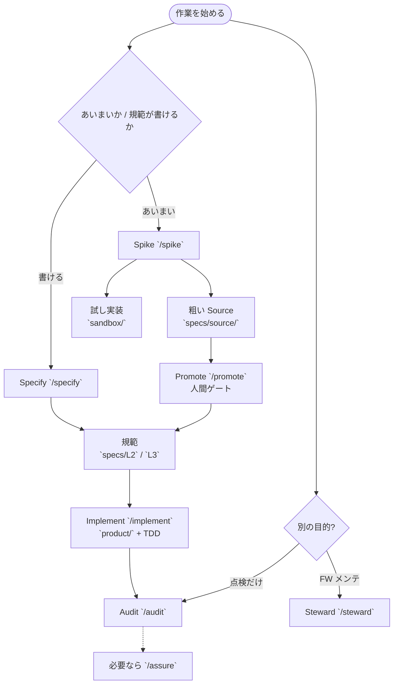
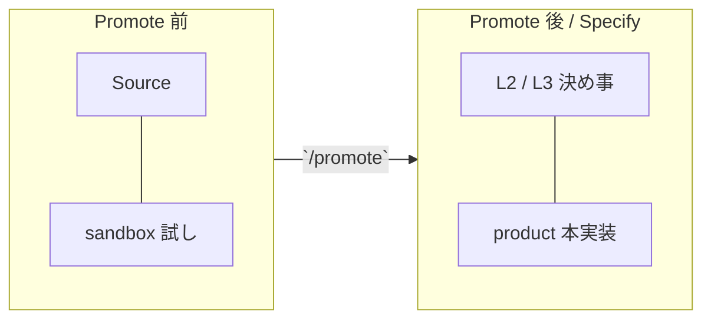
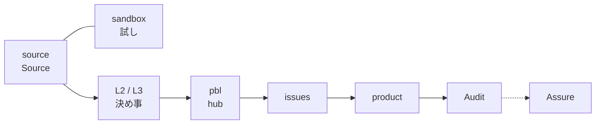

# ForgOS

**モードで回す、AI 工程 OS。**

スキルの使いこなしではなく、**モード**でアプリとインフラの開発品質を揃えます。リポジトリ規約と Cursor 第一の工程を、一つのスターターにまとめています。

## Features

- **モード駆動** — 第一分岐は Spike or Specify。Implement / Audit / Steward は続く入口。フロー（Pipeline）とは別軸
- **パイプライン** — source(+sandbox) → L2/L3 → pbl → issues → product → 点検（map と cut は同一セッション可）。Source を書く起動は `/spec-source`
- **置き場** — source↔sandbox、L2/L3↔product/。成熟度（draft / stable / confirmed）は凍結／完了ゲート（`done` は stable 以上）
- **決め事（What）が正本** — Promote 後は **決め事 > コード**。How は `product/`。PBI はハブにとどめる
- **Implement は TDD** — 単体が緑になるまで完了としない
- **Audit / Assure** — 仕様と実装の乖離、および仕様の保証 Coverage・品質実現を指摘する

人間はコードレビューではなく、**仕様意図・整合**をレビューします。

## Quickstart

1. このリポジトリを template として複製する
2. Cursor で開き、[AGENTS.md](./AGENTS.md) と [CONTEXT.md](./CONTEXT.md) に目を通す
3. 入口に迷ったら **`/ask-me`**（ルーター）。下のモード表でも可

技術スタックに拘りがなければ、先に **`/bootstrap-product`** で default example を `product/` に展開し、リポジトリをプロダクト用に仕立てる（examples / デモは削除される）。

動く参考実装は [examples/taskboard](./examples/taskboard/)（Bootstrap 前の default）。

## 流れ（Mode・仕様・実装）

**入口（Mode）とフロー（Pipeline）は別軸。** 迷ったら `/ask-me`。

### 1. 入口の分岐



Spike で Source を置く起動は **`/spec-source`**（置き場と同名。旧名 `/draft` は使わない）。

### 2. 仕様と実装の置き場



成熟度（**draft** / stable / confirmed）は L2/L3 の **凍結と完了** のゲート。`product/` に書いてよいのは L2/L3 があれば成熟度 draft でも可。**`done` は stable 以上**。成熟度の draft とスキル `/spec-source` は別物。

### 3. パイプライン（成果物の流れ）



対応する起動（参考）: Source へ書く → `/spec-source`（試しは `sandbox/`）／ 取り込む → `/promote` ／ hub → `/map` ／ 切る → `/cut` ／ 実装 → `/implement` ／ 点検 → `/audit`（→ `/assure`）。

`/map` と `/cut` は同一セッション可。Promote は独立モードではない（Audit 必須・人間ゲート）。

## 作業モード

開始時は **モード** を選ぶ。手順の正本は Agent 向けの `AGENTS.md` と `.cursor/skills/modes/`。

**第一分岐**

| モード | 目的 | 起動 |
|--------|------|------|
| Spike | あいまい要件 → 粗い Source ＋ sandbox | `/spike` |
| Specify | L2/L3 に規範を直書き | `/specify` |

**第二段**

| モード | 目的 | 起動 |
|--------|------|------|
| Implement | L2/L3 に従い `product/` 実装 ＋ TDD（`done` は stable 以上） | `/implement`（TDD: `/tdd`） |
| Audit | 仕様↔実装の乖離と拡大解釈の指摘 | `/audit` |
| Steward | L1・スキル等の FW メンテ | `/steward` |

早見: 曖昧なら Spike／書けるなら Specify／実装なら Implement／点検なら Audit／FW 直しなら Steward。

## Directory

```text
specs/     仕様（L1 / L2 横断 / L3 アプリ関心 / source＝機能 PRD）
quality/   実装後に保証する挙動・品質（単体／内部結合が FW 保証。システムは任意）
adr/       任意の経緯（必須ではない）
pbl/       PBI / Epic（hub。説明は pbl/README.md）
product/   実装（L2/L3 紐づけ。内部構成は任意）
sandbox/   Source の試しコード（Spike）
examples/  参考実装（Bootstrap 前）
.cursor/   モード・パイプラインスキルとルール
```

ガイド用の `docs/` 文書は置かない（各 README / rules / skills）。

## Concepts

| 状態 | 正本 |
|------|------|
| Spike | Source（粗い）＋ sandbox |
| Promote 後 | **決め事（What）> コード**。How は `product/` |
| Specify | L2/L3（＋必要なら PBI） |

## Docs

- [仕様モデル](./specs/README.md)
- [品質・挙動保証](./quality/README.md)
- [PBL（hub）](./pbl/README.md)
- [L1 憲法](./specs/L1/constitution.md)
- 経緯（例）: [ADR-0001](./adr/0001-maturity-locus-and-entry-split.md)
- Agent 入口: [AGENTS.md](./AGENTS.md)
- スキル案内（ルーター）: [`.cursor/skills/ask-me/SKILL.md`](./.cursor/skills/ask-me/SKILL.md)（`/ask-me`）

L1 版: [`specs/L1/VERSION`](./specs/L1/VERSION)

## Status

初期は template 複製と本リポの skills / L1 コピー運用です。versioned パッケージ配布は後続です。

## License

リポジトリに LICENSE がある場合はそれに従う。
